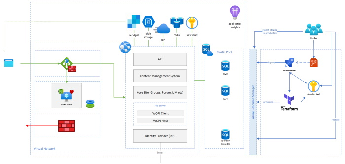

# Architecture

## High Level 'Base Platform' Overview

We are proposing a design that we believe to be a good foundation for self-hosting the platform in your Azure cloud.  This will evolve as we learn more and add new capabilities.

We believe this design captures the minimum *requirements* for a scale-up deployment of the platform.  For scale-out deployments, please refer to the [specific documentation](./scale-out/README.md) for that approach.    

The platform is designed to run in environments of varying maturity, and it is important for us that each evolves independently.  To this end, the reader should consider that any further detail discussed herein is to be thought of as optional for the base case, and good practice for the more mature roll out.

### Open Source

One of the key principles of this project is to use off-the-shelf open-source software, thus the options available to us has necessarily driven the design.  Where no viable open-source option has been found, we have developed.

### Components

The base platform is essentially the seamless integration of a small number of existing open-source applications.  

- [Umbraco CMS](https://github.com/umbraco/Umbraco-CMS) for management of content and custom page design
  - [Umbraco ContentAPI](https://github.com/deMD/UmbracoContentApi) for Headless API
- [MVCForum](https://github.com/YodasMyDad/mvcforum) to add group discussions
- [Collabora Online](https://github.com/CollaboraOnline/online) for in-browser file editing/viewing (forked off [LibreOffice](https://github.com/LibreOffice/core)).  This may be more generically referred to as the WOPI-Client in our documentation.
  - [Collabora CODE](https://www.collaboraoffice.com/code/) comes with a free license for editing up to 10 concurrent files and is available to pull down from [Docker Hub](https://hub.docker.com/r/collabora/code/)
- [Identity Server](https://github.com/IdentityServer/IdentityServer4) for identity and access control
- [File Server](./file-server/README.md) is an optional custom built component that implements the open [WOPI protocol](https://wopi.readthedocs.io/) (the WOPI-Host) and stores files in Azure Storage.  
  - You could swap this out with an open-source alternative such as [Next Cloud](https://github.com/nextcloud) and you can find an [open-source integration with Collabora on GitHub](https://github.com/nextcloud/richdocuments)
  - [WebDAV](https://en.wikipedia.org/wiki/WebDAV) support is earmarked for future development such that the platform can be extended to support alternate file viewing/editing clients such as Microsoft Office, although licenses permitting, you may prefer to explore an alternative WOPI-Client such as [Office Web Apps](https://www.office.com/?ms.officeurl=webapps).
- [ElasticSearch](https://github.com/elastic/elasticsearch) to provide searchable distributed indexing
- [Redis](https://github.com/redis/redis) to provide distributed caching

We have (in the diagram) keep the databases of each component (where it needs one) separate.  While not strictly necessary, this approach allows these components to scale-up independently if needed.  It should be appreciated that so long as your non-functional requirements are met, it might be more appropriate for you to stand up and share a single database.

### Tools

In the same open-source spirit we adopted for the components, we have also endeavoured to use, and where practical contribute to, open-source projects that provide us with the tools we need to help improve the quality of our development efforts.

- [Terraform](https://github.com/hashicorp/terraform) with the Azure-RM provider
- [Terragrunt](https://github.com/gruntwork-io/terragrunt)
- [Checkov](https://github.com/bridgecrewio/checkov)
- [LetsEncrypt](https://letsencrypt.org/)

## Change process and approvals

See [Governance documentation](../governance/README.md).

## FutureNHS Architecture

The FutureNHS platform is to be made available to more than 1.5 million users and in the success case, will be considered a critical piece of their information sharing infrastructure.  As you might expect, it has strong non-functional requirements in the areas of scalability, security, performance and resilience that would not be met by the base design.  The base architecture, while reflective of the [Beta infrastructure requirements and development environments](./development-environment/README.md), will not be representative of the final production design.

For more information on the direction of travel taken by FutureNHS, please visit our [FutureNHS Production Environment](./production-environment/README.md) documentation.